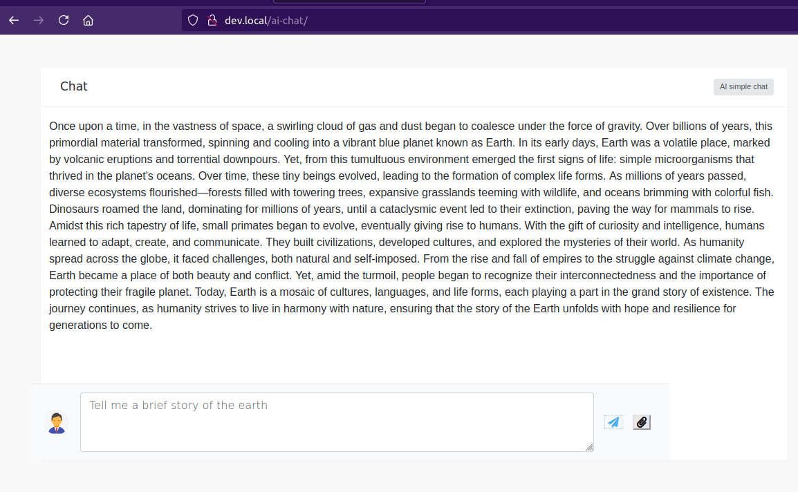

### Simple AI Chat to test GitHub Models

GitHub offered some free tokens to test their [AI Models](https://docs.github.com/en/github-models)

You can test this using their Codespaces. But since I wanted to implement a simple chat in PHP, I though about making this simple steps:

- Adding the GitHub Token in an .env variable (Check later install instructions)
- Getting a simple Bootstrap HTML template
- For the moment just keep it down to two simple calls: Chat AI and upload image to describe it's contents

STATE:

CHAT: Implemented
IMAGE UPLOAD: Not yet, needs the PHP Logic.

That is essentially what it does!

### Install

This is using [composer](https://getcomposer.org) to get the dependencies so make sure to get it running in the command line. 

Just clone this repository, go to the directory where it is checked out and run:

    composer install
    
The only requirement is a library called **phpdotenv** that reads the variables defined in a file and adds it to your ENV variables.
This file is in purpouse exclude it from the repository, so please add it:

    touch .env

Then edit it with any text editor and add your GITHUB_TOKEN:

    GITHUB_TOKEN="my_token"
    
This is just a token to be able to access Azure API and talk with the AI model.

Then you can just upload this to your server or run it locally.

### Preview

